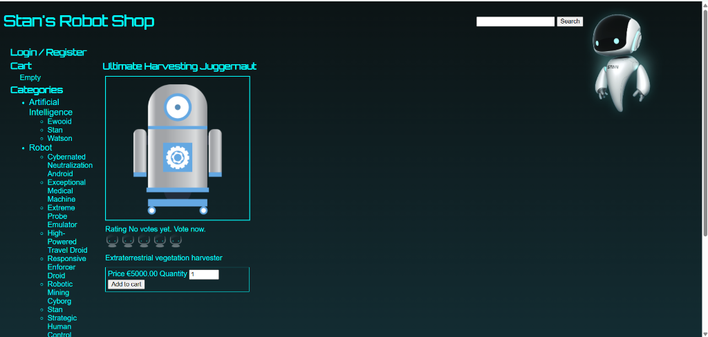
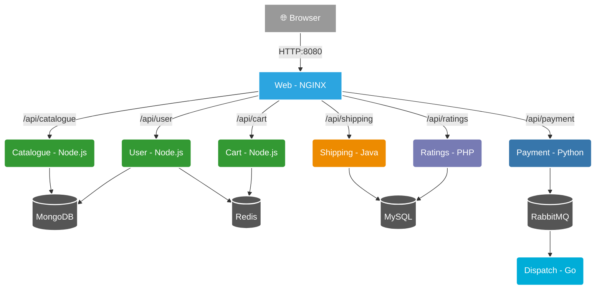

<div align="center">
  <h1>🤖 Stan's Robot Shop</h1>
  <p><i>A modern, polyglot microservices e-commerce application.</i></p>

  <p>
    
    
    
    
    
    
  </p>
</div>

---

## 📸 App Preview



## 🚀 Overview

**Stan's Robot Shop** is a sample microservice application used as a hands-on sandbox for container orchestration, CI/CD, and observability. It consists of **eight services** written in **six languages**, backed by **four data stores**. 

This repository includes:
- 🔄 **CI Pipelines** publishing to personal registries.
- 🐳 **Local-Run paths** for day-to-day development.
- 📦 **Refactored EKS charts** for Kubernetes deployments.
- 📚 **Comprehensive Learning Path** in [**DEVOPS_ROADMAP.md**](DEVOPS_ROADMAP.md).

> **Disclaimer:** Error handling is patchy and there is no security built in. This is deliberate — the defects are the teaching material!

## 🏗️ Architecture

A robust microservices mesh where each service owns its data layer:



### Routing Table

| Path | Backend |
|---|---|
| `/api/catalogue/` | `catalogue:8080` |
| `/api/user/` | `user:8080` |
| `/api/cart/` | `cart:8080` |
| `/api/shipping/` | `shipping:8080` |
| `/api/payment/` | `payment:8080` |
| `/api/ratings/` | `ratings:80` |

### Services Summary

| Service | Language | Data Store | Port |
|---------|----------|------------|------|
| **🕸️ Web** | NGINX + AngularJS | — | `8080` |
| **📦 Catalogue** | Node.js 20 | MongoDB | `8080` |
| **👤 User** | Node.js 20 | MongoDB + Redis | `8080` |
| **🛒 Cart** | Node.js 20 | Redis | `8080` |
| **🚚 Shipping** | Java (Spring Boot) | MySQL | `8080` |
| **⭐ Ratings** | PHP (Symfony) | MySQL | `80` |
| **💳 Payment** | Python (Flask) | RabbitMQ (Pub) | `8080` |
| **📨 Dispatch** | Go | RabbitMQ (Sub) | — |

<details>
<summary><b>📁 Project Structure</b></summary>

```text
.
├── .github/workflows/           8 CI pipelines, one per service
│
├── catalogue/ user/ cart/       Node.js services
├── shipping/                    Java / Spring Boot
├── ratings/                     PHP / Symfony
├── payment/                     Python / Flask
├── dispatch/                    Go
├── web/                         nginx + AngularJS UI
│
├── mongo/ mysql/                Data stores with SEED DATA (users, products, geo)
├── docker-compose.yaml          Builds from source, upstream image names
├── docker-compose.local.yaml    Pulls only, YOUR registry  ← day-to-day
├── .env / .env.local            Registry and tag variables
│
├── K8s/ EKS/ AKS/ GKE/          Kubernetes / Helm charts (AWS, Azure, Google)
├── OpenShift/ Swarm/ DCOS/      Alternative orchestrators
│
├── fluentd/                     Log shipping for Compose and Kubernetes
├── load-gen/                    Locust load generator
│
├── DEVOPS_ROADMAP.md            12-part learning path  ← start here
└── PRACTICE_GUIDE.md            Index into the roadmap
```
</details>

<details>
<summary><b>🐳 Where the images come from</b></summary>

Twelve containers run in this stack. Conflating where their images come from is a common source of errors (like an empty product catalogue).

1. **Built by CI**: Each service pushes its own `:latest` and `:${github.run_number}` to your registry.
2. **Upstream with baked data**: `rs-mongodb` and `rs-mysql-db`. These are NOT the official `mongo` or `mysql` images—they contain the actual product and user data!
3. **Open source, unmodified**: `redis` and `rabbitmq`.
4. **Base images**: The `FROM` lines in the Dockerfiles, used during CI build.

</details>

<details>
<summary><b>🔄 CI/CD, Observability & Load Gen</b></summary>

- **CI Pipelines:** There are 8 GitHub Action workflows in `.github/workflows/`, one per service. They build the image and push it to your Docker Hub on changes. 
- **Metrics:** `cart` and `payment` expose `/metrics` for Prometheus.
- **Logs:** `fluentd/` ships log-forwarding configs for both Compose and Kubernetes.
- **Load Generation:** A Locust load generator is included in `load-gen/`. You can run it via `docker compose -f docker-compose.yaml -f docker-compose-load.yaml up -d`.

</details>

## 🛠️ Quick Start

**1. Clone & Configure**
```bash
# Update .env.local with your Docker Hub username
DH_USER=your_username
```

**2. Run Locally (Fastest)**
```bash
docker compose --env-file .env.local -f docker-compose.local.yaml up -d
```
🌐 Open [http://localhost:8080](http://localhost:8080) to view the shop!

**3. Teardown**
```bash
docker compose --env-file .env.local -f docker-compose.local.yaml down -v
```

## ☸️ Advanced Deployment

Ready to scale? Robot Shop can be deployed to:
- **Kubernetes (Minikube/Kind)**
- **AWS EKS**
- **Azure AKS & Google GKE**
- **Docker Swarm & OpenShift**

Detailed instructions for all platforms are available in the [**DevOps Roadmap**](DEVOPS_ROADMAP.md).

## 📖 Learning & Practice

Take your DevOps skills to the next level with our curated learning materials:

- 👉 **[PRACTICE_GUIDE.md](PRACTICE_GUIDE.md):** Quick overview of DevOps practices.
- 👉 **[DEVOPS_ROADMAP.md](DEVOPS_ROADMAP.md):** A 12-part comprehensive learning path from Docker to GitOps with ArgoCD.

---
<div align="center">
  <i>Forked from <a href="https://github.com/instana/robot-shop">instana/robot-shop</a>. Licensed under Apache 2.0.</i>
</div>
